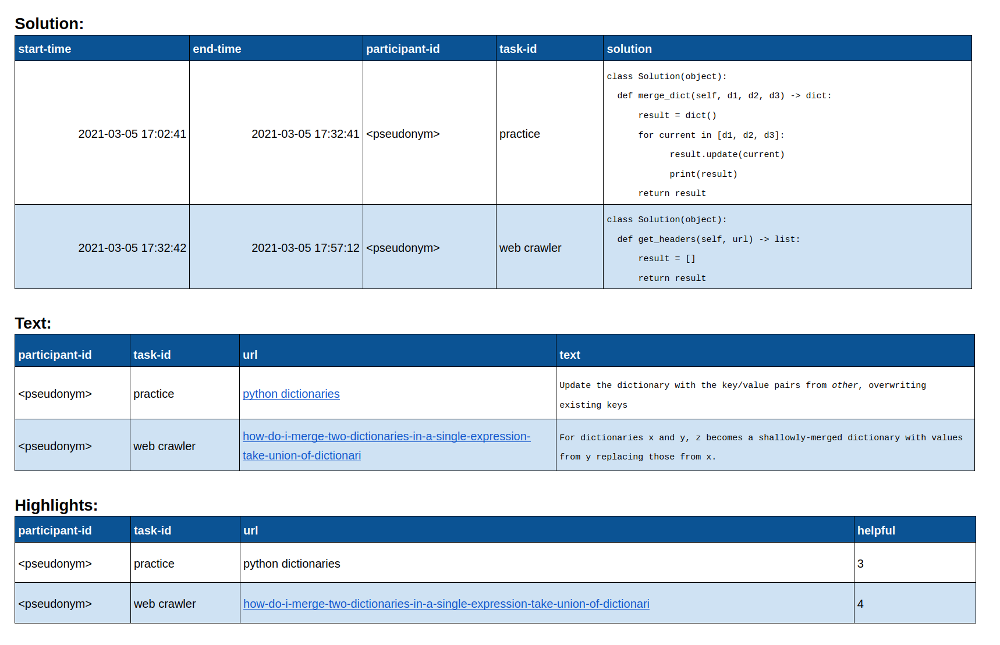

# Identifying Task-Relevant Knowledge in Natural Language Software Engineering Artifacts

### Principal Investigator: 

Dr. Gail Murphy, Dept. of Computer Science, University of British Columbia (murphy@cs.ubc.ca, +1 604 822 5169)

### Co-Investigators: 

Arthur Marques, graduate student, Dept. of Computer Science, University of British Columbia (msarthur@cs.ubc.ca)

### Study Purpose:

The purpose of this study is to design a non-intrusive approach for identifying which parts of a natural language artifact are useful during a software development task so as to aid developers in finding information relevant to their tasks.

To accomplish this objective, we seek to investigate which text in non-source code artifacts software developers deem as relevant to a software task and whether text automatically identified and highlighted assists task completion.

### What you will be asked to do:

This  is an online study, performed in a single session that will take no longer than 2 hours to complete. The study uses a web browser plugin that allows you to select text deemed relevant to a software task and that automatically highlights text in certain web pages. The study is composed of an introductory session, a period in which you are asked to work on a set of tasks, and a follow-up survey. 

If you agree to participate in this study, we will provide you with a link to the web browser plugin and installation instructions. After installation, you will have the opportunity to practice experimental procedures in a sample task.

In the second part, you will be asked to provide a solution in the form of written code for 2 software tasks. The tasks are drawn from Python online problems and require you to inspect reference documentation so that you can write your solution. 

For each task, you will have to read in any order that you wish their related documents and write your solution for that task. In the first task, we ask you to use the plugin to manually select text that you consider relevant and that was helpful to reach your solution. For the second, the plugin will automatically highlight text and, after completing the task, you must rate how helpful were the highlights shown. 

Completing a task is not mandatory and you will be allowed to work on each task for at most 50 minutes. You will proceed to the next task when you declare that you have finished your current task or after the 50 minutes mark. Please note that the quality of your code or time is not a determining factor, and we encourage you to work at your normal pace. 

When you finish your last assigned task, the final step in the experiment is an online survey that allows you to submit the text highlighted in the first task and that asks you to review how helpful was the text automatically highlighted in each document of the second task.

We will conclude each session debriefing the experiment, providing reference solutions for each task, and giving you the opportunity to enter a raffle for one of two 10.2-inch iPad Wi‑Fi 64GB.

### Known Risks:

The main risk is the time spent participating in the study. This amounts to the time allocated to perform the study tasks and the experimental procedures. We are mitigating this risk by allowing you to select a convenient time for study participation. Also, you can terminate the study at any point in time without providing any reason.

The web browser plugin does not track your web browsing activity and you have the chance to review the data it produced before submitting it through the online survey. The risks are those commonly associated with the use of computers, such as potential eye, wrist, or neck strain.

### Potential benefits:

We do not expect there to be any potential benefit from participating in this study. However, you may find it interesting to reflect on your information-seeking behavior and how you judge information as relevant. Direct benefits can arise if our findings lead to tools that can automatically identify relevant information so as to assist you in your daily information-seeking activities. 

### Payment:

Provided that you have completed at least one of the two tasks in the study, you will have the opportunity to enter a raffle for one out of two 10.2-inch iPad Wi‑Fi 64GB. We define a complete solution as one that produces an output that matches known expected outputs. Expected outputs accompany each task in the form of “examples”, each with an input, output, and an explanation of why that is the expected output.

Winners will be randomly selected on Feb 28th 2022, and will be announced on Mar 2nd, 2022 at approximately 10am (Pacific Time). The co-investigator will contact winners by email. Winners have up to three days to provide confirmation that they accept the prize. Failure to do so will result in the draw of a new winner following the same procedures. Odds of winning depend on the number of entrants.

The data stored for the raffle will not compromise your confidentiality. If you revoke consent you are still entitled to the raffle. 

### Data, Storage & Confidentiality:

We collect data related to the solution you wrote, text in an artifact that you have manually highlighted, and your ratings on the usefulness of the text automatically highlighted in a document. All data is anonymized and will not contain any identifying information. 

You will be identified by number or pseudonyms in any internal or academic research publication or presentation. If we choose to use one of your submitted solutions or text highlighted data, they will be attributed to a participant number or pseudonym. 

All data will be saved on the University of British Columbia cloud-based file system. We will maintain all anonymized data obtained until the moment you revoked consent. The principal investigator will be responsible for the data during its retainment time. The data will be stored for five years, after which local copies will be permanently deleted. 

A copy of the anonymized data will be publically available due to open access purposes. An excerpt of the data made public is presented below:

**Where:** 

* Start-time indicates the date and exact time that you have started a task;
* End-time indicates the date and exact time that you have finished a task;
* Participant-id represents a number or a pseudonym (e.g, P1 or Nissan) so that the researcher can analyze the data per-participant. Please note that at any point in time the number or pseudonym can be traced back to any identifying information;
* Task-id represents a number or text so that the researcher can analyze the data per-task;
* Solution indicates your solution－in the form of written code－for the task;
* Url represents the address of a web page that you have used during the experiment; Each task has a set of web pages that we expect you to use; 
* Text represents the text in a web page that you have manually highlighted 
* Rating a number indicating－in a Likert scale－how helpful were the automatic highlights shown to you in this url.

### Use of the Data:

The results of this study will potentially appear in both internal and external academic research presentations and publications, such as academic journals and conference proceedings.

Your text highlights may be useful for designing and evaluating methods to automatically find the relevant information in textual documents. We may wish to use the highlight items in the future for this purpose. Please note that such data does not require any information that can be traced back to you.

### Contact for information about the study:

If you have any questions or desire further information with respect to the study, you may contact Dr. Gail Murphy (murphy@cs.ubc.ca, +1 604-822-5169).

Who can you contact if you have complaints or concerns about the study?

If you have any concerns or complaints about your rights as a research participant and/or your experiences while participating in this study, contact the Research Participant Complaint Line in the UBC Office of Research Ethics at 604-822-8598 or in long-distance email RSIL@ors.ubc.ca or call toll free 1-877-822-8598.

### Consent

Your participation in this study is entirely voluntary. You are free to withdraw your participation at any point during the study, without needing to provide any reason. Any information you contributed up to your withdrawal will be retained and used in this study unless you request otherwise.

You will be provided with a link to an electronic consent survey. By consenting to participate in this study, you confirm the following statements:

* An investigator explained the study and listed conditions to me. I had the opportunity to ask questions. I understood the answers and accepted them.
* I am at least 18 years old.
* I had enough time to make the decision to participate and I agreed to participate.
* I am aware that the data will be made publically available
* I am aware that the data may be used for designing future methods to automatically finding relevant information in textual documents

_______

Version 1.3, December 2, 2021

Ethics ID: H19-04054

