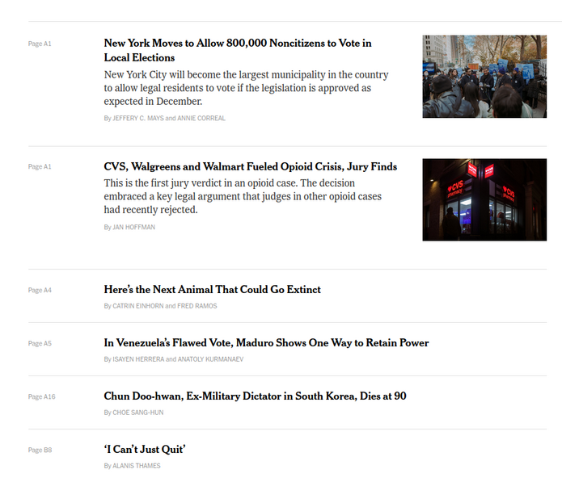

# New York Times web scrapper

New York Times has an archive all its articles published at a given date: `https://www.nytimes.com/section/todayspaper?redirect_uri=https%3A%2F%2Fwww.nytimes.com%2F`

An example of the articles is shown below




Given a `string` representing a url of a NY Times Today's,

you must write an algorithm using the `BeautifulSoup` and `requests` to scrap all the headlines of that page.


## Example 1


**Input:**

```python

```


**Output:**

```python

```

**Explanation:**


## Example 2


**Input:**

```python

```

**Output:**

```python

```

**Explanation:**
