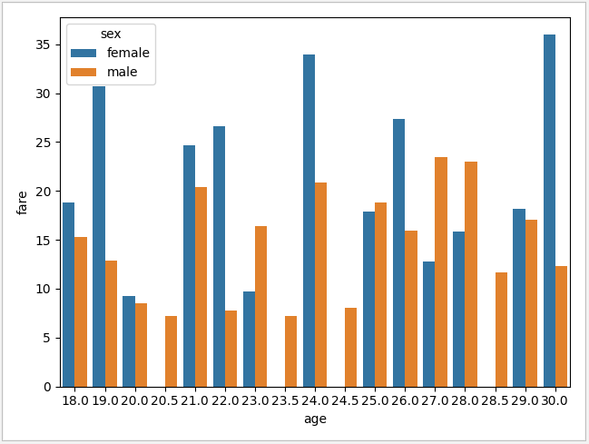

# Titanic data analysis

## Tip - 3

Before calling the `seaborn.barplot` function with the right parameters, you must sort your dataframe. 

See which values the plot uses in the `x-axis` to decide how to sort your data:

