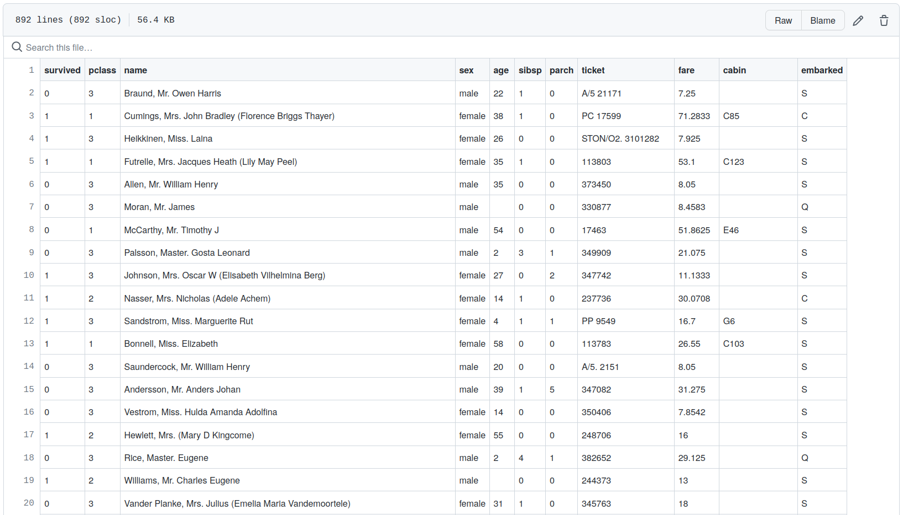
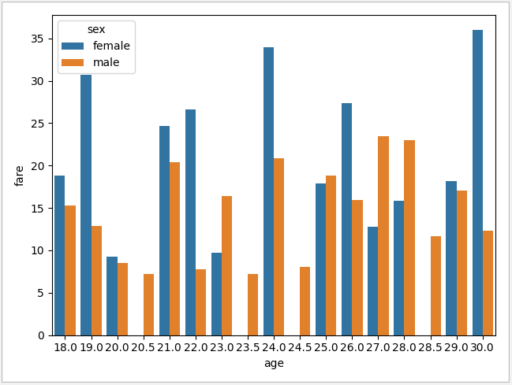

# Titanic data analysis


Data about passengers on the Titanic offer an interesting yet simple scenario for data manipulation, filtering, and visualization.


For this particular dataset, each row provides information in the following format:


| Variable  | Definition | Key |
| --------  | ---------- | --- |
|survival | Survival| 0 = No, 1 = Yes |
|pclass |	Ticket class |	1 = 1st, 2 = 2nd, 3 = 3rd|
|sex |	Sex |	 |
|Age |	Age in years 	| |
|sibsp 	# of siblings / spouses aboard the Titanic 	| |
|parch 	# of parents / children aboard the Titanic 	| |
|ticket 	Ticket number 	| |
|fare |	Passenger fare 	| |
|cabin |	Cabin number 	| |
|embarked |	Port of Embarkation |	C = Cherbourg, Q = Queenstown, S = Southampton |


A sample of the dataset is shown below:



___


## Task


Given a `string` representing a url for the titanic dataset (in `csv` format),

you must write an algorithm using the `pandas` and `seaborn` modules to create a barchart with the passengers' average fare according to the following constraints


**Constraints**

* Passengers age must be `>= 18`

* Passengers age must be `<= 30`

* Averages are affected by outliers, so you must ignore fares `>= 100`

* The only variables of interest are `sex`, `age`, and `fare`


## Example


**Input:**

```python
data = "https://raw.githubusercontent.com/mwaskom/seaborn-data/master/raw/titanic.csv"

```


**Output:**




**Explanation:**


You must return a call to `seaborn.barplot` so that tests can plot the chart and check the values in the `x-axis` and `y-axis` according to the data.


___


## Resources

Please **use only** the following resources to find information that might assist you complete this task:


* [How do I read and write tabular data?](https://pandas.pydata.org/docs/getting_started/intro_tutorials/02_read_write.html)
* [How do I select a subset of a DataFrame?](https://pandas.pydata.org/docs/getting_started/intro_tutorials/03_subset_data.html)
* [API reference pandas.core.groupby](https://pandas.pydata.org/docs/reference/api/pandas.core.groupby.DataFrameGroupBy.aggregate.html)
* [API reference pandas.DataFrame.sort_values](https://pandas.pydata.org/docs/reference/api/pandas.DataFrame.sort_values.html)
* [API reference seaborn.barplot](https://seaborn.pydata.org/generated/seaborn.barplot.html)
* [Pandas query(): How to Filter Rows of Pandas Dataframe?](https://cmdlinetips.com/2019/07/how-to-select-rows-of-pandas-dataframe-with-query-function/)
* [How to Make a Seaborn Barplot](https://www.sharpsightlabs.com/blog/seaborn-barplot/)
* [Filter Dataframe Rows Based on Column Values in Pandas](https://www.delftstack.com/howto/python-pandas/how-to-filter-dataframe-rows-based-on-column-values-in-pandas/)
* [How do I select rows from a DataFrame based on column values?](https://stackoverflow.com/questions/17071871/how-do-i-select-rows-from-a-dataframe-based-on-column-values)
* ['Could not interpret input' error with Seaborn when plotting groupbys](https://stackoverflow.com/questions/32908315/could-not-interpret-input-error-with-seaborn-when-plotting-groupbys)
* [Difference between "as_index = False", and "reset_index()" in pandas groupby](https://stackoverflow.com/questions/51866908/difference-between-as-index-false-and-reset-index-in-pandas-groupby/51933722)
* [Pandas read_csv from url](https://stackoverflow.com/questions/32400867/pandas-read-csv-from-url)