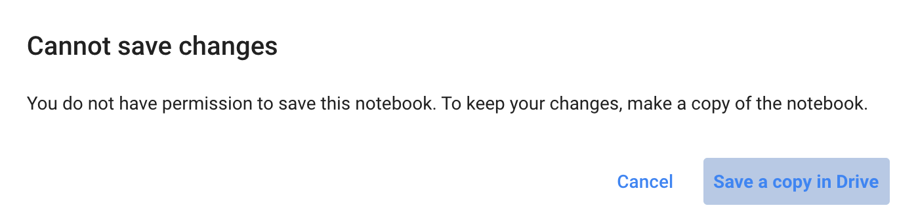
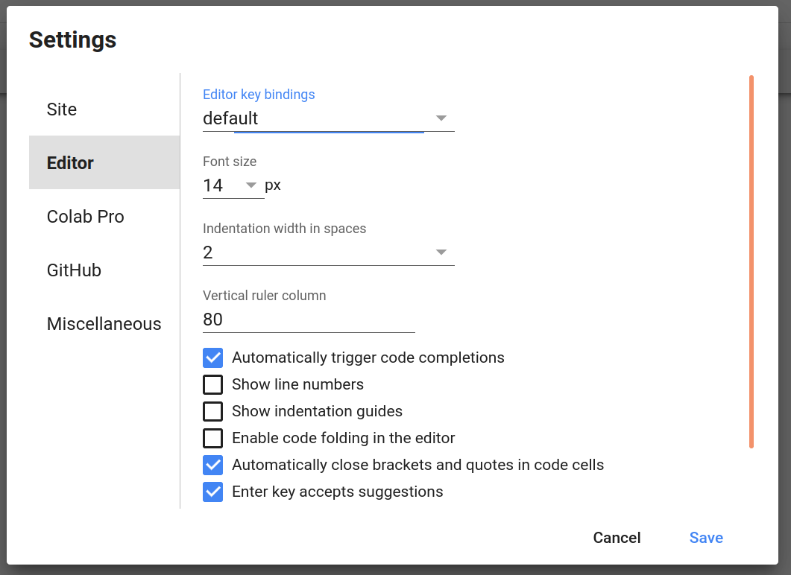
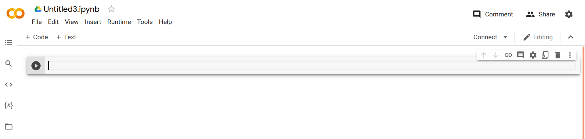

# Instructions


below, you will find an example for a task. each task has a


* `task` field, which provides a short description about what you need to do;
* `examples` showing the input format for each task, expected output for that same input, and potential explanations as of why that is the expected output;
* `resources` a list of links. Please **USE ONLY** the links provided under resources to search for information that might assist you complete your task;
* `codelab` a link to a virtual environment where you can write your solution. 

Once you finish a task, copy the code in the solution cell from your virtual environment and submit it on Qualtrics.


# Task Title


You got hold of a list of contact addresses from different sources. Ideally, you should merge these contacts so it's easy to import them in your phone. 

___


## Task


Given a `dict1`, `dict2` and `dict3` representing three contact books


you must write an algorithm using the dict module to merge all contact books in a single dictionary


**Constraints**

* A number appears in no more than a single dictionary


## Example 1


**Input:**

```python
dic1={1:10, 2:20}
dic2={3:30, 4:40}
dic3={5:50,6:60}
```

**Output:**

```python
expected = {1: 10, 2: 20, 3: 30, 4: 40, 5: 50, 6: 60}
```

**Explanation:**

The final output has the results from all dictionaries together. 


___


## Resources

Please **use only** the following resources to find information that might assist you complete this task:


* [dictionaries](https://docs.python.org/3/tutorial/datastructures.html#dictionaries){target="_blank"}
* [merge dictionaries](https://stackoverflow.com/questions/38987/how-do-i-merge-two-dictionaries-in-a-single-expression-take-union-of-dictionari){target="_blank"}
* [yet another merge dictionaries](https://stackoverflow.com/questions/65539313/combine-two-dictionaries-with-preference-to-one-of-them){target="_blank"}


<br>
<br>


# Colab


Each task has a link to an online environment where you can do the task:

Start by saving a copy of the colab to your local drive:

1. Press `ctrl + s` or `cmd + s` and select save a copy in drive:




2. Update the editor key bindings to the one of your preference

    * Go to `Tools` > `settings`

    * 

    * Under editor check the options that best apply to you (e.g., default, vim, etc)


3. Near each cell, there is a run button. You can click it to run the code of that cell

    * 

    * `ctrl + enter` or `cmd + enter` also runs the content of a cell


## Practice 

Head to [pratice-colab](https://colab.research.google.com/drive/18XUYSK1lUynsK1Mn9nj7foxDzw7MKSSO?usp=sharing){target="_blank"} and try the phone list task yourself. Use the three resources provided under [Resources](#Resources)


**IMPORTANT:** We are not measuring the quality of your code, just if your solution passes the test cases for each task.

<br>

___

<br>

## How do I test my solution?

<br>

**Running the code**

1. Each solution has a section labeled: `"Use the code below to test your solution."`

    * it serves as a `"main"` function that runs your code with the given arguments


2. Add print statements as you seem fit and run the code in this cell to see your progress

<br>

**Running test cases**


1. Each solution has a section labeled: `"Use the code below to test your solution."`

    * it serves as `"unit tests"`  that verify your code against the provided examples


2. Add print statements as you seem fit and run the code in both cells on this section to see your progress

<br>

___

<br>

## See the solution for the practice


Check the [solution for the practice-task](https://colab.research.google.com/drive/1opTGbTV0NqEA9g-uRISYPQ-yyI6QeeLO?usp=sharing){target="_blank"}. 

You should submit the code in the Solution block on Qualtrics. For example, for the practice task, you should copy the snippet:

<details>
    <summary>CLICK to see solution code snippet</summary>
    class Solution(object):

        def merge_dict(self, d1: dict, d2: dict, d3: dict) -> dict:
            
            result = dict()
            for current in [d1, d2, d3]:
            result.update(current)
            print(result) # just for debugging

            return result
</details>     
