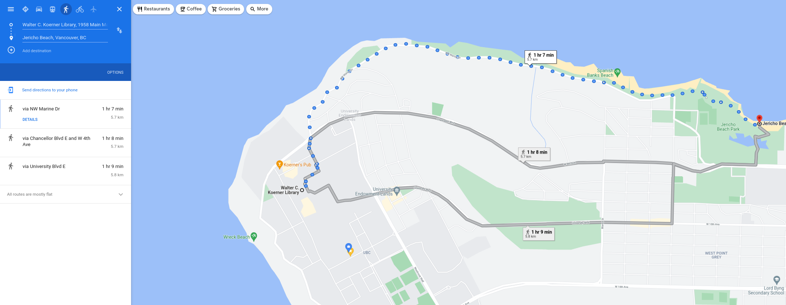

# Student's picnic place


Picnics or outdoor lunches are great, especially during summer time. The student association often decides to meet at a rendezvous point and walk towards a picnic place what gives them time to small talk and catch-up with the latest news and gossips. 

For example, students can meet at `Walter C. Koerner Library, 1958 Main Mall, Vancouver, BC V6T 1Z2` and decide to have picnic at `Jericho Beach, Vancouver, BC` (quite the walk, but anyway)





Some students are not happy with walking distances and the student association wants to build a small system that finds the distance between a rendezvous location and a suggested picnic place. 

Every week, students submit a picnic address and the system should find the place closest to the starting location.

___


## Task


Given a `string` representing rendezvous address and a `list` of suggested picnic addresses

you must write an algorithm using the `geopy` module to find the closest picnic address.


**Constraints**

* The suggested address must be within 10 km from a meeting location.

* If no suggestion is within 10 km, you should return `None`

* There can be invalid addresses either in the meeting place or in the suggestion list

* If two places have the same distance, your solution should return the address that appears first in the list of suggestions 


## Example 1


**Input:**

```python
rendezvous_address = "1958 Main Mall, Vancouver, BC V6T 1Z2"
suggestions = ["Spanish Banks West Concession"]
```

**Output:**

```python
expected = "Spanish Banks West Concession"
```

**Explanation:**

There is a single suggestion. The distance between the rendezvous address and the suggested location is less than the max allowed distance. Therefore, the expected output is `Spanish Banks West Concession`


## Example 2


**Input:**

```python
rendezvous_address = "1958 Main Mall, Vancouver, BC V6T 1Z2"
suggestions = [
    "Spanish Banks West Concession",
    "Museum of Anthropology University of British Columbia"
]
```

**Output:**

```python
expected = "Museum of Anthropology University of British Columbia"

```

**Explanation:**


The distance between the meeting place and `Spanish Banks` is 5.7km.  The distance between the meeting place and the `Museum of Anthropology` is 600m. The museum is closer, hence it should be the expected output. 


___


## Resources

Please **use only** the following resources to find information that might assist you complete this task:


* [GeoPy’s documentation](https://www.cs.ubc.ca/~msarthur/hf_geopy.readthedocs.html)
* [Locations in Python (Geocoding w/Geopy)](https://www.cs.ubc.ca/~msarthur/hf_locations-in-python-geocoding-w-geopy.html)
* [Obtaining latitude and longitude of multiple locations using Geopy](https://www.cs.ubc.ca/~msarthur/hf_obtaining-latitude-and-longitude-of-multiple-locations-using-geopy.html)
* [Python module for getting latitude and longitude from the name of a US city](https://www.cs.ubc.ca/~msarthur/hf_python-module-for-getting-latitude-and-longitude-from-the-name-of-a-us-city.html)
* [Calculate point based on distance and direction](https://www.cs.ubc.ca/~msarthur/hf_calculate-point-based-on-distance-and-direction.html)
* [Geocoding in Python Using Geopy](https://www.cs.ubc.ca/~msarthur/hf_geocoding-in-python-using-geopy.html)
* [Python Geopy to find geocode of an Address](https://www.cs.ubc.ca/~msarthur/hf_python-geopy-to-find-geocode-of-an-address.html)

<br>

**tip:** `ctrl + left mouse click` opens each link in a new tab

<br>

___

## Colab

[coding environment](https://colab.research.google.com/drive/1ATb2fE-9CQMkgO3EkKil3ShAODxmV1KT?usp=sharing)
